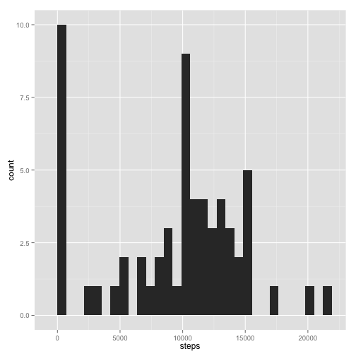
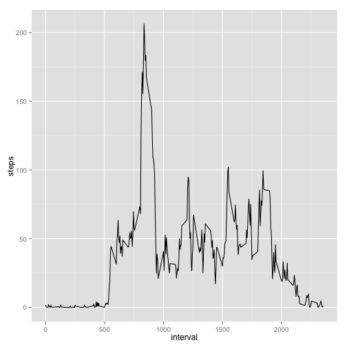
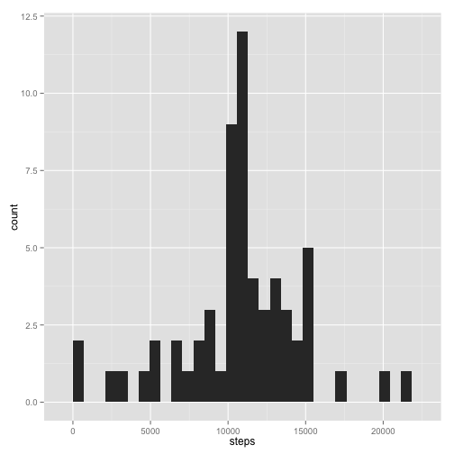
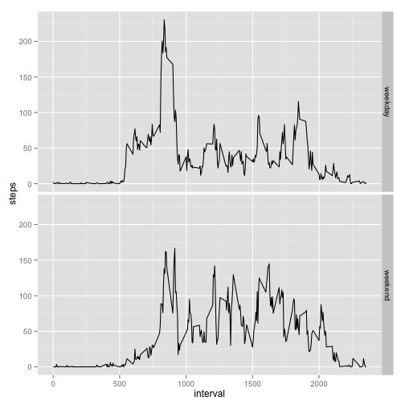

PA1
============

###Loading and processing the data


```r
#setwd("~/Documents/github/RepData_PeerAssessment1")
activity = read.csv('activity.csv',header=T)
```

###Calculate the mean total number of steps taken per day

#####1. Make a histogram of the total number of steps taken each day


```r
library(plyr)
library(ggplot2)
totalplot <- ddply(activity,.(date),summarize,steps=sum(steps,na.rm=T))
qplot(steps,data=totalplot,geom='histogram')
```

```
## stat_bin: binwidth defaulted to range/30. Use 'binwidth = x' to adjust this.
```

 

#####2. Calculate and report the mean and median total number of steps taken per day


```r
median <- median(totalplot$steps,na.rm=T)
mean <- mean(totalplot$steps,na.rm=T)
```

The mean and median of total number of steps taken per day are 9354.2295082 and 
10395 respectively.


### Average daily activity pattern

#####1. Make a time series plot (i.e. type = "l") of the 5-minute interval (x-axis) and the average number of steps taken, averaged across all days (y-axis)


```r
daily_averages = ddply(activity,.(interval),summarize,steps=mean(steps,na.rm=T))
ggplot(data=daily_averages,aes(x=interval,y=steps))+
    geom_line()
```

 

#####2. Which 5-minute interval, on average across all the days in the dataset, contains the maximum number of steps?


```r
max <- max(daily_averages$steps,na.rm=T)
max_interval <- with(daily_averages,interval[steps==max])
```

The interval contains the maximum number of steps is 835.


###Inputting missing values

#####1. Calculate and report the total number of missing values in the dataset (i.e. the total number of rows with NAs)


```r
nas = count(activity[is.na(activity)])$freq
```

Total number of rows with NAs: 2304.

#####2. Devise a strategy for filling in all of the missing values in the dataset. The strategy does not need to be sophisticated. For example, you could use the mean/median for that day, or the mean for that 5-minute interval, etc.


```r
mid_activity <- ddply(activity,.(interval),transform,
                      mean_of_the_interval=mean(steps,na.rm=T))
for (i in 1:nrow(mid_activity)) {
    if (is.na(mid_activity$steps[i])==T) {
        mid_activity$steps[i] = mid_activity$mean_of_the_interval[i]
    }
}
```

The strategy used here is to use the mean of the 5-min interval to fill the missing data.

#####3. Create a new dataset that is equal to the original dataset but with the missing data filled in.


```r
activity_no_missing <- mid_activity[c('interval','steps','date')]
```

####4. Make a histogram of the total number of steps taken each day and Calculate and report the mean and median total number of steps taken per day. Do these values differ from the estimates from the first part of the assignment? What is the impact of inputing missing data on the estimates of the total daily number of steps?


```r
totalplot_no_missing <- ddply(activity_no_missing,.(date),summarize,steps=sum(steps))
qplot(steps,data=totalplot_no_missing,geom='histogram')
```

```
## stat_bin: binwidth defaulted to range/30. Use 'binwidth = x' to adjust this.
```

 

```r
mean_no_missing <- mean(totalplot_no_missing$steps)
median_no_missing <- median(totalplot_no_missing$steps)
```

The median steps of each day is 1.0766189 &times; 10<sup>4</sup>; the mean steps of each day
is 1.0766189 &times; 10<sup>4</sup>.

Both values are bigger than the estimates from the first part of the assignment.

Inputting missing data increases the estimates of the total daily number of steps.


###Are there differences in activity patterns between weekdays and weekends?

#####1. Create a new factor variable in the dataset with two levels – “weekday” and “weekend” indicating whether a given date is a weekday or weekend day.


```r
activity_no_missing$day <- weekdays(as.Date(activity_no_missing$date))
for (i in 1:nrow(activity_no_missing)) {
    if (activity_no_missing$day[i] == 'Saturday' | activity_no_missing$day[i] == 'Sunday') {
        activity_no_missing$day[i] = 'weekend'
    } else {
        activity_no_missing$day[i] = 'weekday'
    }
}
```

#####2. Make a panel plot containing a time series plot (i.e. type = "l") of the 5-minute interval (x-axis) and the average number of steps taken, averaged across all weekday days or weekend days (y-axis). See the README file in the GitHub repository to see an example of what this plot should look like using simulated data.


```r
daily_no_missing <- ddply(activity_no_missing,.(day,interval),summarize,steps=mean(steps))
ggplot(data=daily_no_missing,aes(x=interval,y=steps))+
    geom_line()+
    facet_grid(day~.)
```

 


